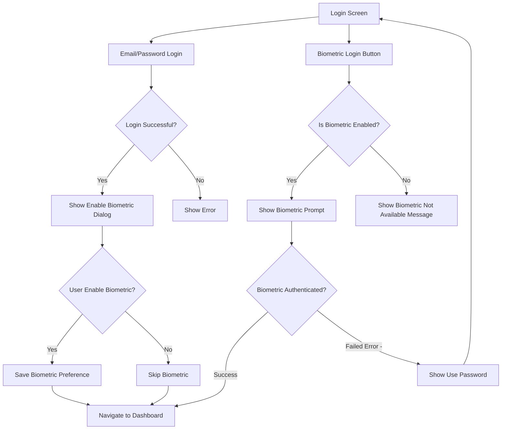

# Biometric Login Implementation Plan

## Overview
Implement biometric login for existing users in the LOFI Android app. Users will be able to enable biometric login after successful email/password authentication and use it for subsequent logins.

## Architecture Diagram



## Implementation Steps

### Phase 1: Data Layer Changes

#### 1.1 Add Biometric Preference to PreferencesManager
**File:** `app/src/main/java/com/loanfinancial/lofi/data/local/datastore/PreferencesManager.kt`

Add the following:
```kotlin
// Add new key constant
const val KEY_BIOMETRIC_ENABLED = "biometric_enabled"

// Add new preference key
private val PREF_BIOMETRIC_ENABLED = booleanPreferencesKey(KEY_BIOMETRIC_ENABLED)

// Add methods
suspend fun setBiometricEnabled(enabled: Boolean) {
    dataStore.edit { preferences ->
        preferences[PREF_BIOMETRIC_ENABLED] = enabled
    }
}

suspend fun isBiometricEnabled(): Boolean = 
    dataStore.data.map { it[PREF_BIOMETRIC_ENABLED] ?: false }.first()

// Add flow for real-time updates
val biometricEnabledFlow: Flow<Boolean> = 
    dataStore.data.map { it[PREF_BIOMETRIC_ENABLED] ?: false }
```

### Phase 2: Login Screen Updates

#### 2.1 Update LoginUiState
**File:** `app/src/main/java/com/loanfinancial/lofi/ui/features/auth/login/LoginViewModel.kt`

Add biometric-related state:
```kotlin
data class LoginUiState(
    // ... existing fields ...
    val isBiometricEnabled: Boolean = false,
    val showEnableBiometricDialog: Boolean = false,
    val biometricAuthSuccess: Boolean = false,
)
```

#### 2.2 Add Enable Biometric Dialog to LoginScreen
**File:** `app/src/main/java/com/loanfinancial/lofi/ui/features/auth/login/LoginScreen.kt`

Add a dialog that appears after successful login:
```kotlin
@Composable
fun EnableBiometricDialog(
    onDismiss: () -> Unit,
    onEnable: () -> Unit,
    onSkip: () -> Unit,
) {
    AlertDialog(
        onDismissRequest = onDismiss,
        title = { Text("Enable Biometric Login") },
        text = { Text("Use fingerprint or face recognition to log in faster.") },
        confirmButton = { TextButton(onClick = onEnable) { Text("Enable") } },
        dismissButton = { TextButton(onClick = onSkip) { Text("Maybe Later") } },
    )
}
```

#### 2.3 Update LoginViewModel
Add methods to handle biometric preferences:
```kotlin
fun checkBiometricStatus() {
    viewModelScope.launch {
        val isEnabled = preferencesManager.isBiometricEnabled()
        _uiState.update { it.copy(isBiometricEnabled = isEnabled) }
    }
}

fun onEnableBiometric() {
    viewModelScope.launch {
        preferencesManager.setBiometricEnabled(true)
        _uiState.update { 
            it.copy(
                showEnableBiometricDialog = false,
                isBiometricEnabled = true
            ) 
        }
    }
}

fun onSkipBiometric() {
    _uiState.update { it.copy(showEnableBiometricDialog = false) }
}
```

### Phase 3: New Biometric Login Feature

#### 3.1 Create BiometricLoginScreen
**File:** `app/src/main/java/com/loanfinancial/lofi/ui/features/auth/biometric/BiometricLoginScreen.kt`

```kotlin
@Composable
fun BiometricLoginScreen(
    onBiometricSuccess: () -> Unit,
    onBiometricFailed: (String) -> Unit,
    onUsePasswordClick: () -> Unit,
    viewModel: BiometricLoginViewModel = hiltViewModel(),
) {
    val uiState by viewModel.uiState.collectAsState()
    
    LaunchedEffect(uiState.biometricSuccess) {
        if (uiState.biometricSuccess) {
            onBiometricSuccess()
        }
    }
    
    LaunchedEffect(uiState.error) {
        uiState.error?.let { error ->
            onBiometricFailed(error)
        }
    }
    
    // Auto-trigger biometric on screen load
    LaunchedEffect(Unit) {
        viewModel.authenticate()
    }
    
    // UI Content
    Column(
        modifier = Modifier
            .padding(24.dp)
            .fillMaxSize(),
        verticalArrangement = Arrangement.Center,
        horizontalAlignment = Alignment.CenterHorizontally,
    ) {
        Text(
            text = "Login with Biometric",
            style = MaterialTheme.typography.headlineMedium,
        )
        Spacer(modifier = Modifier.height(16.dp))
        Text(
            text = "Use your fingerprint or face to login",
            style = MaterialTheme.typography.bodyMedium,
        )
        Spacer(modifier = Modifier.height(48.dp))
        
        // Biometric Icon Button
        IconButton(
            onClick = { viewModel.authenticate() },
            modifier = Modifier.size(80.dp),
        ) {
            Icon(
                imageVector = Icons.Default.Fingerprint,
                contentDescription = "Biometric Login",
                modifier = Modifier.size(64.dp),
                tint = MaterialTheme.colorScheme.primary,
            )
        }
        
        Spacer(modifier = Modifier.height(32.dp))
        
        TextButton(onClick = onUsePasswordClick) {
            Text("Use Password Instead")
        }
    }
}
```

#### 3.2 Create BiometricLoginViewModel
**File:** `app/src/main/java/com/loanfinancial/lofi/ui/features/auth/biometric/BiometricLoginViewModel.kt`

```kotlin
data class BiometricLoginUiState(
    val isLoading: Boolean = false,
    val biometricSuccess: Boolean = false,
    val error: String? = null,
    val isBiometricAvailable: Boolean = true,
)

@HiltViewModel
class BiometricLoginViewModel @Inject constructor(
    private val biometricAuthenticator: BiometricAuthenticator,
    private val preferencesManager: PreferencesManager,
) : ViewModel() {
    private val _uiState = MutableStateFlow(BiometricLoginUiState())
    val uiState: StateFlow<BiometricLoginUiState> = _uiState.asStateFlow()
    
    init {
        checkBiometricAvailability()
    }
    
    private fun checkBiometricAvailability() {
        val isAvailable = biometricAuthenticator.isBiometricAvailable() && 
                         biometricAuthenticator.isBiometricEnrolled()
        _uiState.update { it.copy(isBiometricAvailable = isAvailable) }
    }
    
    fun authenticate() {
        if (!_uiState.value.isBiometricAvailable) {
            _uiState.update { 
                it.copy(error = "Biometric authentication is not available") 
            }
            return
        }
        
        viewModelScope.launch {
            _uiState.update { it.copy(isLoading = true, error = null) }
            
            biometricAuthenticator.authenticate(
                title = "Login to LOFI",
                subtitle = "Authenticate to continue",
                description = "Use your fingerprint or face to login",
                negativeButtonText = "Use Password",
            ).collect { result ->
                when (result) {
                    is BiometricResult.Success -> {
                        _uiState.update { 
                            it.copy(
                                isLoading = false,
                                biometricSuccess = true,
                            ) 
                        }
                    }
                    is BiometricResult.Error -> {
                        _uiState.update { 
                            it.copy(
                                isLoading = false,
                                error = result.errorMessage,
                            ) 
                        }
                    }
                    is BiometricResult.Cancelled -> {
                        _uiState.update { it.copy(isLoading = false) }
                    }
                    is BiometricResult.NotAvailable -> {
                        _uiState.update { 
                            it.copy(
                                isLoading = false,
                                error = "Biometric authentication is not available on this device",
                            ) 
                        }
                    }
                    is BiometricResult.NotEnrolled -> {
                        _uiState.update { 
                            it.copy(
                                isLoading = false,
                                error = "No biometric credentials enrolled. Please set up fingerprint or face recognition in device settings.",
                            ) 
                        }
                    }
                }
            }
        }
    }
    
    fun onBiometricSuccessHandled() {
        _uiState.update { it.copy(biometricSuccess = false) }
    }
    
    fun onErrorShown() {
        _uiState.update { it.copy(error = null) }
    }
}
```

### Phase 4: Navigation Updates

#### 4.1 Add New Route
**File:** `app/src/main/java/com/loanfinancial/lofi/core/navigation/Routes.kt`

```kotlin
object Routes {
    // ... existing routes ...
    const val BIOMETRIC_LOGIN = "biometric_login"
}
```

#### 4.2 Update NavGraph
**File:** `app/src/main/java/com/loanfinancial/lofi/core/navigation/NavGraph.kt`

Add biometric login route:
```kotlin
import com.loanfinancial.lofi.ui.features.auth.biometric.BiometricLoginScreen

// In NavHost:
composable(Routes.BIOMETRIC_LOGIN) {
    BiometricLoginScreen(
        onBiometricSuccess = {
            navController.navigate(Routes.DASHBOARD) {
                popUpTo(Routes.LOGIN) { inclusive = true }
            }
        },
        onBiometricFailed = { error ->
            // Show error and stay on screen
        },
        onUsePasswordClick = {
            navController.popBackStack()
        },
    )
}
```

#### 4.3 Update LoginScreen
**File:** `app/src/main/java/com/loanfinancial/lofi/ui/features/auth/login/LoginScreen.kt`

Update to show biometric button when enabled and handle navigation:
```kotlin
@Composable
fun LoginScreen(
    onLoginClick: () -> Unit = {},
    onSkipLoginClick: () -> Unit = {},
    onRegisterClick: () -> Unit = {},
    onForgotPasswordClick: () -> Unit = {},
    onBiometricLoginClick: () -> Unit = {},
    viewModel: LoginViewModel = hiltViewModel(),
) {
    val uiState by viewModel.uiState.collectAsState()
    
    // Check biometric status on first composition
    LaunchedEffect(Unit) {
        viewModel.checkBiometricStatus()
    }
    
    // Show enable biometric dialog after successful login
    if (uiState.showEnableBiometricDialog) {
        EnableBiometricDialog(
            onDismiss = { viewModel.onSkipBiometric() },
            onEnable = { viewModel.onEnableBiometric() },
            onSkip = { viewModel.onSkipBiometric() },
        )
    }
    
    // Scaffold content...
    
    // Add Biometric Login Button (conditionally shown)
    if (uiState.isBiometricEnabled) {
        Spacer(modifier = Modifier.height(16.dp))
        SocialAuthButton(
            text = "Login with Biometric",
            onClick = onBiometricLoginClick,
            modifier = Modifier.fillMaxWidth(),
        )
    }
}

// Update navigation call
LoginScreen(
    onBiometricLoginClick = {
        navController.navigate(Routes.BIOMETRIC_LOGIN)
    },
    // ... other params
)
```

## Files to Modify

1. `app/src/main/java/com/loanfinancial/lofi/data/local/datastore/PreferencesManager.kt`
2. `app/src/main/java/com/loanfinancial/lofi/ui/features/auth/login/LoginViewModel.kt`
3. `app/src/main/java/com/loanfinancial/lofi/ui/features/auth/login/LoginScreen.kt`
4. `app/src/main/java/com/loanfinancial/lofi/core/navigation/Routes.kt`
5. `app/src/main/java/com/loanfinancial/lofi/core/navigation/NavGraph.kt`

## Files to Create

1. `app/src/main/java/com/loanfinancial/lofi/ui/features/auth/biometric/BiometricLoginScreen.kt`
2. `app/src/main/java/com/loanfinancial/lofi/ui/features/auth/biometric/BiometricLoginViewModel.kt`

## Testing Checklist

- [ ] Verify biometric availability check works correctly
- [ ] Test biometric authentication flow (success, failure, cancel)
- [ ] Test enable/disable biometric login functionality
- [ ] Test navigation between Login and BiometricLogin screens
- [ ] Test that biometric preference is saved correctly
- [ ] Test error handling for not enrolled biometrics
- [ ] Test "Use Password" fallback flow
