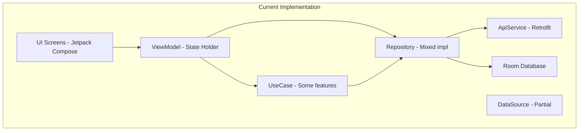

# Code Review & Refactoring Plan - Lofi Android App

## Executive Summary

This document provides a comprehensive analysis of the existing Lofi Android codebase against the planned architecture requirements. It identifies gaps, missing features, and areas that need refactoring to align with the Clean Architecture + MVVM pattern with hardware integration requirements.

---

## 1. Architecture Analysis

### Current Architecture Overview



### Strengths
- Clean package structure following feature-based organization
- Hilt DI properly configured
- Room database with entities and DAOs
- Retrofit + OkHttp for networking
- Firebase integration (Auth, FCM)
- Basic unit tests with MockK and Turbine
- Spotless for code formatting
- CI/CD with GitHub Actions

### Critical Gaps Identified

---

## 2. Hardware Integration Gaps

### 2.1 Biometric Authentication - MISSING

**Status**: Not implemented  
**Priority**: HIGH (Required for loan submission)

**Current State**:
- No biometric-related code exists
- ApplyLoanViewModel has no biometric verification
- No BiometricManager or BiometricPrompt implementation

**Required Implementation**:
```kotlin
// core/biometric/BiometricAuthenticator.kt - MISSING
interface BiometricAuthenticator {
    suspend fun authenticate(): BiometricResult
    fun isBiometricAvailable(): Boolean
    fun isBiometricEnrolled(): Boolean
}

// feature/loan/presentation/applyloan/ApplyLoanViewModel.kt - NEEDS REFACTOR
class ApplyLoanViewModel @Inject constructor(
    private val applyLoanUseCase: ApplyLoanUseCase,
    private val biometricAuthenticator: BiometricAuthenticator  // ADD
) : ViewModel() {
    // Add biometric authentication before loan submission
}
```

**Action Items**:
- [ ] Add `androidx.biometric:biometric:1.1.0` dependency
- [ ] Create `core/biometric/` module
- [ ] Implement BiometricAuthenticator interface
- [ ] Refactor ApplyLoanViewModel to require biometric before submission
- [ ] Add BiometricAuthenticating state to ApplyLoanUiState

---

### 2.2 Location Access - MISSING

**Status**: Not implemented  
**Priority**: HIGH (Required for loan application)

**Current State**:
- No location-related code exists
- ApplyLoanViewModel doesn't capture GPS coordinates
- No LocationManager implementation

**Required Implementation**:
```kotlin
// core/location/LocationManager.kt - MISSING
interface LocationManager {
    suspend fun getCurrentLocation(): LocationResult
    fun hasLocationPermission(): Boolean
}

// feature/loan/presentation/applyloan/ApplyLoanViewModel.kt - NEEDS REFACTOR
class ApplyLoanViewModel @Inject constructor(
    private val applyLoanUseCase: ApplyLoanUseCase,
    private val locationManager: LocationManager  // ADD
) : ViewModel() {
    // Capture location before loan submission
}
```

**Action Items**:
- [ ] Add `com.google.android.gms:play-services-location:21.1.0` dependency
- [ ] Create `core/location/` module
- [ ] Implement LocationManager with FusedLocationProviderClient
- [ ] Add location permission handling in AndroidManifest.xml
- [ ] Refactor ApplyLoanViewModel to capture and include location data

---

### 2.3 Camera & File Upload - PARTIALLY IMPLEMENTED

**Status**: Basic camera exists for profile photo only  
**Priority**: HIGH (Required for loan document upload)

**Current State**:
- ProfileScreen.kt has camera launcher for profile photo
- No document upload for loan application
- No image compression before upload
- No UploadManager abstraction

**Existing Code** (ProfileScreen.kt):
```kotlin
// Camera Launcher exists but only for profile
val cameraLauncher = rememberLauncherForActivityResult(
    contract = ActivityResultContracts.TakePicture()
) { success ->
    if (success) {
        viewModel.uploadProfilePicture(tempPhotoUri)
    }
}
```

**Required Implementation**:
```kotlin
// core/media/CameraManager.kt - MISSING
interface CameraManager {
    suspend fun captureImage(): CameraResult
    suspend fun selectFromGallery(): CameraResult
    suspend fun compressImage(imagePath: String, maxSizeKB: Int): String
}

// core/media/UploadManager.kt - MISSING
interface UploadManager {
    suspend fun uploadDocument(
        filePath: String,
        documentType: DocumentType,
        loanId: String? = null
    ): Flow<UploadResult>
}

// feature/loan/presentation/applyloan/components/DocumentUpload.kt - MISSING
@Composable
fun DocumentUploadSection(
    viewModel: ApplyLoanViewModel,
    modifier: Modifier = Modifier
) {
    // KTP Upload, Selfie Upload components
}
```

**Action Items**:
- [ ] Add CameraX dependencies
- [ ] Create `core/media/` module
- [ ] Implement CameraManager for document capture
- [ ] Implement UploadManager with presigned URL support
- [ ] Create DocumentUpload UI components
- [ ] Refactor ApplyLoanScreen to include document upload section

---

## 3. DataStore Implementation - NEEDS REFACTOR

### Current State

**File**: `data/local/datastore/PreferencesManager.kt`

```kotlin
// Current - Only saves access_token
class PreferencesManager @Inject constructor(...) {
    companion object {
        private val KEY_ACCESS_TOKEN = stringPreferencesKey("access_token")
    }
    
    suspend fun saveToken(token: String)
    val tokenFlow: Flow<String?>
    suspend fun clear()
}
```

### Required State (Per Plan)

```kotlin
// core/datastore/UserPreferences.kt - NEEDS REFACTOR
class UserPreferences @Inject constructor(
    private val dataStore: PreferencesDataStore
) {
    companion object {
        const val KEY_ACCESS_TOKEN = "access_token"
        const val KEY_REFRESH_TOKEN = "refresh_token"      // ADD
        const val KEY_USER_ID = "user_id"                  // ADD
        const val KEY_USER_EMAIL = "user_email"            // ADD
        const val KEY_USER_NAME = "user_name"              // ADD
        const val KEY_IS_LOGGED_IN = "is_logged_in"        // ADD
        const val KEY_FCM_TOKEN = "fcm_token"              // ADD
    }
    
    suspend fun saveAuthTokens(accessToken: String, refreshToken: String)  // ADD
    suspend fun getAccessToken(): String
    suspend fun getRefreshToken(): String                              // ADD
    suspend fun isLoggedIn(): Boolean                                  // ADD
    suspend fun clearAuthData()                                        // ADD
}
```

**Action Items**:
- [ ] Add `androidx.datastore:datastore-preferences:1.1.2` dependency (exists)
- [ ] Expand PreferencesManager with all required keys
- [ ] Add refresh token support
- [ ] Add user info caching (id, email, name)
- [ ] Add login state tracking
- [ ] Refactor AuthRepositoryImpl to use expanded preferences

---

## 4. Error Handling Pattern - NEEDS REFACTOR

### Current State

**File**: `core/util/Resource.kt`

```kotlin
// Current - Simple Resource wrapper
sealed class Resource<out T> {
    object Loading : Resource<Nothing>()
    data class Success<out T>(val data: T) : Resource<T>()
    data class Error(val message: String, val code: String? = null) : Resource<Nothing>()
}
```

### Required State (Per Plan)

```kotlin
// core/common/result/BaseResult.kt - NEEDS REFACTOR
sealed class BaseResult<out T> {
    data class Success<T>(val data: T) : BaseResult<T>()
    data class Error(val error: ErrorType) : BaseResult<Nothing>()  // CHANGE
    object Loading : BaseResult<Nothing>()
}

// core/common/result/ErrorType.kt - MISSING
sealed class ErrorType {
    // Network Errors
    data class NetworkError(val message: String) : ErrorType()
    data class TimeoutError(val message: String) : ErrorType()
    data class ServerError(val code: Int, val message: String) : ErrorType()
    
    // Client Errors
    data class ValidationError(val fields: Map<String, String>) : ErrorType()
    data class Unauthorized(val message: String) : ErrorType()
    data class Forbidden(val message: String) : ErrorType()
    data class NotFound(val message: String) : ErrorType()
    
    // Local DB Errors
    data class DatabaseError(val message: String) : ErrorType()
    data class CacheError(val message: String) : ErrorType()
    
    // Business Logic Errors
    data class BusinessError(val code: String, val message: String) : ErrorType()
    
    // Unknown
    data class UnknownError(val message: String) : ErrorType()
}
```

**Action Items**:
- [ ] Create `core/common/result/` package
- [ ] Rename Resource to BaseResult (or keep Resource but expand Error)
- [ ] Create comprehensive ErrorType sealed class
- [ ] Refactor all repositories to use new error types
- [ ] Refactor all ViewModels to handle specific error types
- [ ] Update unit tests for new error handling

---

## 5. UI State Pattern - NEEDS REFACTOR

### Current State

**File**: `ui/features/loan/ApplyLoanViewModel.kt`

```kotlin
// Current - Simple data class
data class ApplyLoanUiState(
    val amount: String = "",
    val tenor: String = "",
    val purpose: String = "",
    val isLoading: Boolean = false,
    val isSuccess: Boolean = false,  // Not following sealed class pattern
)
```

### Required State (Per Plan)

```kotlin
// feature/loan/presentation/applyloan/ApplyLoanUiState.kt - NEEDS REFACTOR
sealed class ApplyLoanUiState {
    object Idle : ApplyLoanUiState()
    object Loading : ApplyLoanUiState()
    object BiometricAuthenticating : ApplyLoanUiState()  // ADD
    object CapturingLocation : ApplyLoanUiState()        // ADD
    object UploadingDocuments : ApplyLoanUiState()       // ADD
    data class ValidationError(val errors: Map<String, String>) : ApplyLoanUiState()  // ADD
    data class Success(val loanId: String) : ApplyLoanUiState()
    data class Error(val error: ErrorType) : ApplyLoanUiState()  // CHANGE
}

// feature/loan/presentation/applyloan/ApplyLoanUiEvent.kt - MISSING
sealed class ApplyLoanUiEvent {
    data class AmountChanged(val amount: String) : ApplyLoanUiEvent()
    data class TenorChanged(val tenor: String) : ApplyLoanUiEvent()
    data class PurposeChanged(val purpose: String) : ApplyLoanUiEvent()
    data class DocumentSelected(val uri: Uri, val type: DocumentType) : ApplyLoanUiEvent()  // ADD
    object SubmitClicked : ApplyLoanUiEvent()
    object CancelClicked : ApplyLoanUiEvent()
}
```

**Action Items**:
- [ ] Refactor all UiState classes to sealed classes
- [ ] Create UiEvent classes for all screens
- [ ] Update ViewModels to use event-driven pattern
- [ ] Update Screens to send events instead of calling methods directly

---

## 6. Unit Test Coverage - NEEDS EXPANSION

### Current State

**Existing Tests**:
- `HomeViewModelTest.kt` - Basic tests
- `GetMyLoansUseCaseTest.kt` - Basic test
- `LoanRepositoryImplTest.kt` - Good coverage example
- `LoanRemoteDataSourceTest.kt` - Basic test

### Required Coverage (Per Plan)

| Component | Current | Required | Gap |
|-----------|---------|----------|-----|
| ViewModel | 1 (Home) | All ViewModels | Missing: Login, Register, ApplyLoan, Profile, etc. |
| UseCase | 1 (GetMyLoans) | All UseCases | Missing: Login, GoogleAuth, ChangePassword, etc. |
| Repository | 1 (Loan) | All Repositories | Missing: Auth, User, Notification |
| DataSource | 1 (LoanRemote) | All DataSources | Missing: Auth, User, Local |

**Action Items**:
- [ ] Create `LoginViewModelTest.kt`
- [ ] Create `RegisterViewModelTest.kt`
- [ ] Create `ApplyLoanViewModelTest.kt`
- [ ] Create `ProfileViewModelTest.kt`
- [ ] Create `AuthRepositoryImplTest.kt`
- [ ] Create `UserRepositoryImplTest.kt`
- [ ] Create all missing UseCase tests
- [ ] Add `MainDispatcherRule.kt` for coroutines testing
- [ ] Add `TestDataFactory.kt` for test data

---

## 7. CI/CD Pipeline - NEEDS ENHANCEMENT

### Current State

**File**: `.github/workflows/android.yml`

```yaml
# Current - Basic pipeline
jobs:
  build:
    runs-on: ubuntu-latest
    steps:
    - uses: actions/checkout@v4
    - name: set up JDK 17
    - name: Grant execute permission for gradlew
    - name: Run Spotless Check
    - name: Run Unit Tests
    - name: Build with Gradle
```

### Required State (Per Plan)

```yaml
# Required - Multi-job pipeline
jobs:
  spotless-check:  # ADD - Separate job
    name: Spotless Code Format Check
    runs-on: ubuntu-latest
    steps:
      - name: Run Spotless Check
      - name: Run Spotless Apply (if check fails on PR)

  unit-tests:  # ADD - Separate job with coverage
    name: Unit Tests
    runs-on: ubuntu-latest
    needs: spotless-check
    steps:
      - name: Run Unit Tests
      - name: Generate Test Report
      - name: Upload Test Reports

  build:  # ENHANCE - Add artifact upload
    name: Build Application
    runs-on: ubuntu-latest
    needs: [spotless-check, unit-tests]
    steps:
      - name: Build Debug APK
      - name: Upload Debug APK
      - name: Build Release APK
      - name: Upload Release APK

  lint-check:  # ADD
    name: Lint Check
    runs-on: ubuntu-latest
    needs: build
    steps:
      - name: Run Lint
      - name: Upload Lint Report
```

**Action Items**:
- [ ] Split CI into multiple jobs with dependencies
- [ ] Add test report generation with dorny/test-reporter
- [ ] Add artifact upload for APKs
- [ ] Add lint check job
- [ ] Add Gradle caching for faster builds

---

## 8. Dependency Management - NEEDS ORGANIZATION

### Current State

**File**: `gradle/libs.versions.toml`

```toml
# Current - Basic structure, no bundles
[versions]
agp = "8.13.2"
kotlin = "2.0.21"
...

[libraries]
androidx-core-ktx = { ... }
...
```

### Required State (Per Plan)

```toml
# Required - Organized with bundles
[versions]
biometric = "1.1.0"  # ADD
playServicesLocation = "21.1.0"  # ADD
cameraX = "1.3.1"  # ADD

[libraries]
# Hardware Integration - ADD
biometric = { group = "androidx.biometric", name = "biometric", version.ref = "biometric" }
play-services-location = { ... }
camera-core = { ... }

[bundles]  # ADD
compose = [...]
hilt = [...]
network = [...]
room = [...]
testing = [...]
hardware = [...]  # ADD
```

**Action Items**:
- [ ] Add biometric dependency
- [ ] Add location services dependency
- [ ] Add CameraX dependencies
- [ ] Create dependency bundles
- [ ] Refactor app/build.gradle.kts to use bundles

---

## 9. Global Exception Handler - MISSING

**Status**: Not implemented  
**Priority**: MEDIUM (Developer Mode requirement)

**Required Implementation**:
```kotlin
// core/common/exception/GlobalExceptionHandler.kt - MISSING
class GlobalExceptionHandler @Inject constructor(
    private val context: Context,
    private val isDeveloperMode: Boolean
) : Thread.UncaughtExceptionHandler {
    override fun uncaughtException(thread: Thread, throwable: Throwable) {
        if (isDeveloperMode) {
            showDeveloperErrorDialog(thread, throwable)
            logDetailedError(throwable)
            saveCrashReport(throwable)
        } else {
            reportToFirebase(throwable)
        }
    }
}
```

**Action Items**:
- [ ] Create `core/common/exception/` package
- [ ] Implement GlobalExceptionHandler
- [ ] Create DeveloperErrorActivity
- [ ] Add DEVELOPER_MODE flag to gradle.properties

---

## 10. Notification Deep Linking - NEEDS IMPLEMENTATION

**Current State**:
- MyFirebaseMessagingService receives notifications
- No deep linking implementation
- No NotificationNavigator

**Required Implementation**:
```kotlin
// core/navigation/NotificationNavigator.kt - MISSING
class NotificationNavigator @Inject constructor(
    private val navController: NavController
) {
    fun navigateFromNotification(notification: Notification) {
        when (notification.type) {
            NotificationType.LOAN_APPROVED -> 
                navController.navigate(LoanRoutes.LoanDetail.createRoute(notification.referenceId))
            // ... other cases
        }
    }
}
```

**Action Items**:
- [ ] Create NotificationNavigator
- [ ] Add deep link handling in NavGraph
- [ ] Update MyFirebaseMessagingService to use navigator

---

## 11. File Structure Alignment

### Current vs Required

| Path | Current Status | Required Action |
|------|---------------|-----------------|
| `core/biometric/` | MISSING | Create module |
| `core/location/` | MISSING | Create module |
| `core/media/` | MISSING | Create module |
| `core/common/result/` | PARTIAL | Expand ErrorType |
| `core/common/exception/` | MISSING | Create module |
| `core/datastore/` | EXISTS | Expand functionality |
| `feature/loan/presentation/applyloan/` | EXISTS | Major refactor |
| `test/` | PARTIAL | Add missing tests |

---

## 12. Priority Matrix

### P0 - Critical (Must Have)
1. Biometric Authentication for loan submission
2. Location capture for loan application
3. Document upload (KTP, Selfie) for loan application
4. DataStore expansion (refresh token, user info)

### P1 - High Priority
5. Error handling pattern refactor (ErrorType)
6. UI State pattern refactor (sealed classes)
7. Unit test expansion
8. CI/CD pipeline enhancement

### P2 - Medium Priority
9. Global exception handler
10. Notification deep linking
11. Dependency bundles
12. Code documentation

---

## 13. Implementation Roadmap

### Phase 1: Core Infrastructure (Week 1)
- [ ] Add hardware dependencies (biometric, location, camera)
- [ ] Create core modules (biometric, location, media)
- [ ] Expand DataStore implementation
- [ ] Refactor ErrorType and BaseResult

### Phase 2: Hardware Integration (Week 2)
- [ ] Implement BiometricAuthenticator
- [ ] Implement LocationManager
- [ ] Implement CameraManager and UploadManager
- [ ] Refactor ApplyLoanViewModel with hardware integration

### Phase 3: UI/UX Refactor (Week 3)
- [ ] Refactor all UiState to sealed classes
- [ ] Create UiEvent classes
- [ ] Update all ViewModels and Screens
- [ ] Add document upload UI components

### Phase 4: Testing & CI/CD (Week 4)
- [ ] Create missing unit tests
- [ ] Enhance CI/CD pipeline
- [ ] Add integration tests
- [ ] Performance testing

---

## 14. Summary of Changes Required

### New Files to Create: ~25
- 3 core hardware modules (biometric, location, media)
- 5 exception/result classes
- 4 document upload components
- 10+ unit test files
- 2 CI/CD workflow updates

### Files to Refactor: ~20
- ApplyLoanViewModel (major)
- ApplyLoanScreen (major)
- PreferencesManager (medium)
- All repository error handling (medium)
- All ViewModel UI states (medium)

### Dependencies to Add: 5
- androidx.biometric:biometric:1.1.0
- play-services-location:21.1.0
- CameraX suite (4 libraries)

---

## 15. Conclusion

The current codebase has a solid foundation with Clean Architecture principles, but significant gaps exist in:

1. **Hardware Integration**: Biometric, Location, and Document Upload are completely missing for loan application flow
2. **DataStore**: Needs expansion to support refresh tokens and user caching
3. **Error Handling**: Needs more granular error types
4. **UI State Pattern**: Needs to adopt sealed class pattern consistently
5. **Testing**: Coverage is minimal, needs expansion
6. **CI/CD**: Basic pipeline needs enhancement

The recommended approach is to follow the 4-week roadmap, starting with core infrastructure and progressively adding hardware integration features.
