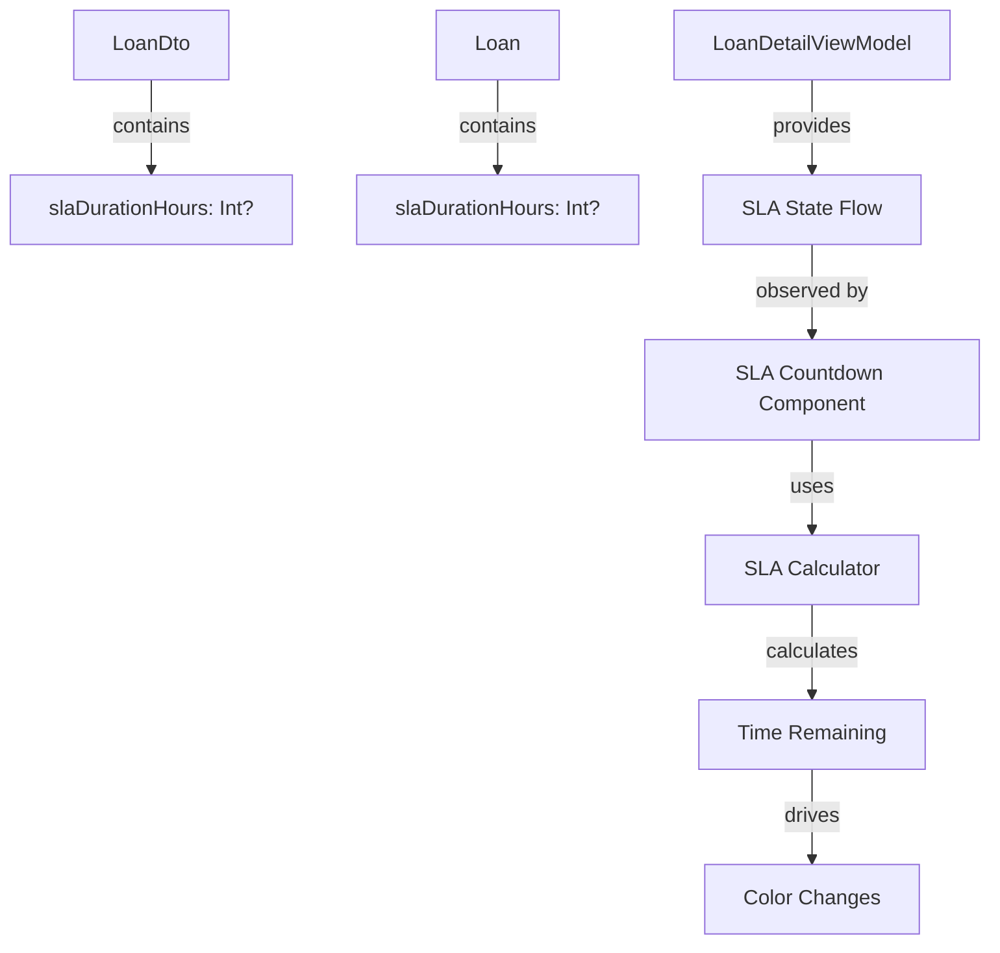

# SLA Countdown Implementation Plan

## Overview
Implement a real-time SLA countdown feature for loan processing that displays on the LoanDetailScreen. The countdown shows time remaining from loan submission until SLA deadline, with color changes based on urgency.

## Architecture



## Implementation Steps

### 1. Data Layer Updates

**File: `app/src/main/java/com/loanfinancial/lofi/data/model/dto/LoanDto.kt`**
- Add `slaDurationHours` field to `LoanDto`
- This represents the SLA duration in hours (e.g., 24, 48, 72)

**File: `app/src/main/java/com/loanfinancial/lofi/domain/model/Loan.kt`**
- Add `slaDurationHours` field to `Loan` domain model
- Update `toDomain()` mapper function

### 2. Utility Class

**File: `app/src/main/java/com/loanfinancial/lofi/core/util/SLACalculator.kt`**
```kotlin
object SLACalculator {
    fun calculateTimeRemaining(
        submittedAt: String?, 
        slaDurationHours: Int?
    ): SLACountdownState
    
    fun getSLAColor(percentageRemaining: Float): Color
    fun formatDuration(millis: Long): String
}

sealed class SLACountdownState {
    data class Active(
        val timeRemainingMs: Long,
        val percentageRemaining: Float,
        val formattedTime: String
    ) : SLACountdownState()
    data object Expired : SLACountdownState()
    data object NoSLA : SLACountdownState()
}
```

### 3. UI Component

**File: `app/src/main/java/com/loanfinancial/lofi/ui/components/SLACountdown.kt`**
```kotlin
@Composable
fun SLACountdown(
    submittedAt: String?,
    slaDurationHours: Int?,
    modifier: Modifier = Modifier
)
```
- Real-time countdown using `LaunchedEffect` + `delay(1000)`
- Color transitions:
  - Green (> 50% remaining)
  - Yellow (25-50% remaining)
  - Orange (10-25% remaining)
  - Red (< 10% remaining or expired)
- Card-based design with icon and formatted time display

### 4. ViewModel Updates

**File: `app/src/main/java/com/loanfinancial/lofi/ui/features/loan/LoanDetailViewModel.kt`**
- Add `SLACountdownState` to `LoanDetailUiState.Success`
- Launch coroutine to update countdown every second
- Expose `SLACountdownState` as StateFlow

### 5. Screen Integration

**File: `app/src/main/java/com/loanfinancial/lofi/ui/features/loan/LoanDetailScreen.kt`**
- Add `SLACountdown` component below Status Card
- Only show for loans with `slaDurationHours` defined
- Show in loan list/history if applicable

## Color Scheme

| Percentage Remaining | Color | Hex |
|---------------------|-------|-----|
| > 50% | Success Green | #4CAF50 |
| 25-50% | Warning Yellow | #FFC107 |
| 10-25% | Alert Orange | #FF9800 |
| < 10% | Error Red | #F44336 |
| Expired | Error Red | #F44336 |

## Time Format Display

- `2d 14h 30m 15s` - when days > 0
- `14h 30m 15s` - when hours > 0
- `30m 15s` - when minutes > 0
- `15s` - when seconds only
- `Expired` - when SLA deadline passed

## Files to Modify

1. `app/src/main/java/com/loanfinancial/lofi/data/model/dto/LoanDto.kt`
2. `app/src/main/java/com/loanfinancial/lofi/domain/model/Loan.kt`
3. `app/src/main/java/com/loanfinancial/lofi/ui/features/loan/LoanDetailViewModel.kt`
4. `app/src/main/java/com/loanfinancial/lofi/ui/features/loan/LoanDetailScreen.kt`

## Files to Create

1. `app/src/main/java/com/loanfinancial/lofi/core/util/SLACalculator.kt`
2. `app/src/main/java/com/loanfinancial/lofi/ui/components/SLACountdown.kt`
